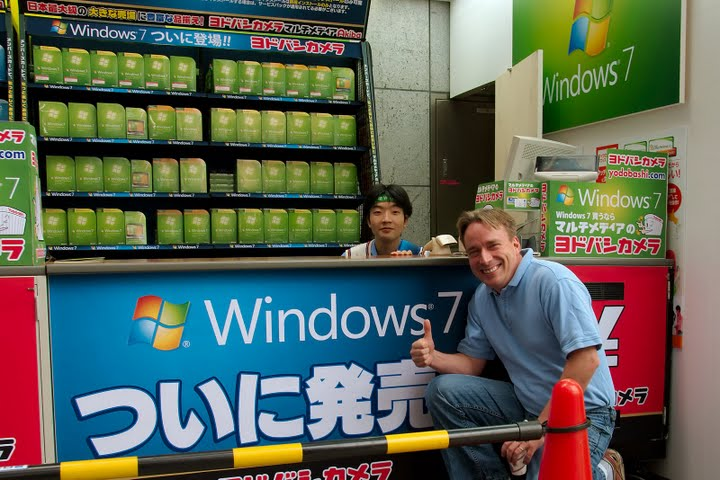

# 背景和历史很重要
写这篇日志是因为最近慢慢的感受到“一件事物”的背景和历史很重要。这里的“一件事物”可以是一个人，人的一句话，一个编程语言或者一个协议等等。

网络上有很多对比事物的文章或者讨论，例如“C++ VS Java”，“Linux VS Windows"等等。有些观点比较偏激，鼓吹一方贬低另一方，比如“Windows很烂，应该全部工作都用Linux来”。这些观点本身没有什么问题，都是一家之言，总会有人出来反驳。这样你来我往的讨论也能促进发展。有一个部分人会被这些观点所引导，变的“偏激"（并不一定是坏事）。但对新人，“偏激”不是一件好事。像我这样容易摇摆的人，就会成为“受害者”。

## A or B
以前，一次偶然的机会让我接触到了Linux。网络上不少人说Linux很棒，完全用Linux工作和生活，然后顺便鄙视一下Windows系统。那时候没见过什么市面，觉得“哇，好厉害啊！我也要学习Linux”。所以就开始了漫无目的折腾。从那些折腾中也学到了不少东西，但始终挫败感更多些。很快就又用回了Windows系统。后来又了解的到Lisp，根据他人的描述也是很厉害的存在。也开始学习折腾，但也不了了之。

之后，大学期间，也是充斥着迷茫和对未来不确定性的担忧，总是喜欢搜索一些对比的文章，像“现在学习C++好还是学习Java好”和“某某框架如何”。尽管从看些文章中也学到不少东西，但是现在回想起来，总觉得浪费时间多一些，而且也增加了自己的迷茫。就算现在，无聊的时候也是挺喜欢看看那些讨论或者文章来打发时间。

其实自己也明白，东西都有其存在的道理。但是直到最近，开始上班了，这个才开始走到心里。话说，在找到工作到上班之前这段时间，也是很迷茫的存在。也是在网络上各种研究公司的情况。然后就了解到公司还在用很“过时”的协议。随便一搜索，就很多人说那个协议有多不好，现代的一个协议有多好。这些加深了我的迷茫感。然后，入职之后，发现公司支持着一堆听都没听过，查都查不到，上个世纪的“协议”。

但是，在对公司文化，业务还有代码的学习过程，我慢慢感受到历史的存在。“历史是什么，我们存在因素就是历史” -- 寻秦记。并不是说这些就是历史遗留问题，不是“问题”，只是转变都有一个过程。我了解到现在还有很多旅游中介订票还是用黑底绿字的终端。和我的领导交流这个，他说就算给他们展示现代化的界面，他们的第一反应也会是，终端在哪里。所以那些“过时”的协议对比起来，可能很不好。但是也有他们存在的必要性，在你所不知道的地方，被默默的使用着。

## Why they say B sucks
像这些“过时”的协议都那么有存在的必要性，何况那些平起平坐的东西。但是，只在创业公司工作过，做的都是新的东西，就不一定会理解那些。可能在他们眼中现代的就是最好，那些“过时”的东西就是垃圾。有人说Linux很好，Windows很烂。那个人很可能做的是Linux相关的工作。有人说学Javascript吧，C++太恐怖了。那个人很可能只做前端开发。

所以，看一个观点，要看到表达这个观点时的上下文，还有表达观点人的背景。特别是当一个东西被批评的时候，要了解一下批评的那个所处的位置和其背景。不相关的人，可能就是道听途说，装一装了解；一些相关的人，也可能会是管中窥豹，不甚了解现实情况；高度相关的人，或许只是抱怨。这时候如果不纠结于对于本身，而是自己问的为什么，多了解下背景，就可能学到不少东西。

## 总结
以上是最近的一些领悟和反思，希望自己以后能更坚定，更辩证的看问题。如果有人刚好读到，也希望有所启迪。用下面三句来结尾，都是突然想到的，但不知道放哪里。

1. “伴随着大机成长，然后慢慢消逝，也是一件很幸福的事” -- 某人。大意是这样的，并不是准确的话，因为我找不到文章了。

2. 以前一些提倡开源的人对微软的鄙视都拍纪录片了，现在微软收购了GitHub。

3. 当两大阵营的吵的不可开交的时候，Linus默默的给Windows 7点了个赞。

(图片来自网络)

4. 现在最想有个Macbook Air。

